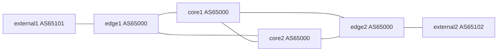
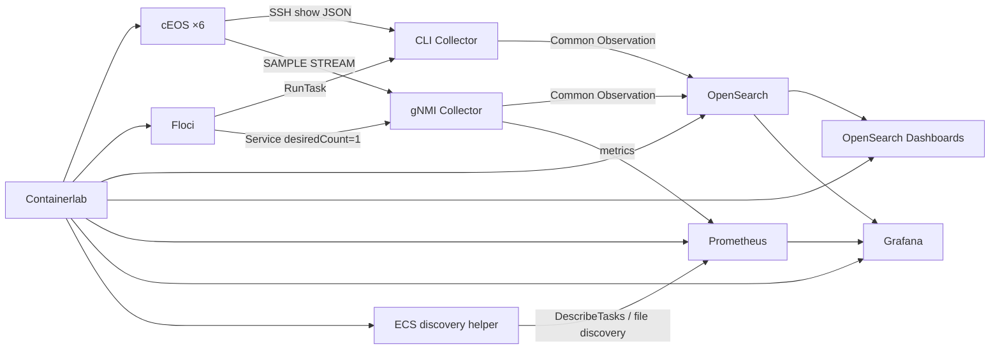

# Containerlab Observability PoC

cEOSで小規模なISPバックボーンを再現し、SSH/CLIとgNMI STREAMで取得した状態を同じObservationへ正規化するローカルPoCです。状態履歴をOpenSearch、メトリクスをPrometheusへ保存し、Grafanaで確認します。



内部はOSPFv2＋Loopback間のfull-mesh iBGP、外部はeBGPです。external1が192.0.2.0/24、external2が198.51.100.0/24を広告します。管理ネットワークは`obs-mgmt`（172.31.100.0/24）で、データプレーンのリンク障害中も収集できます。



## 起動

必要環境はLinux amd64、Docker、Containerlab **0.79.0**、uv、makeです。Docker/Containerlabを実行できる権限が必要です。目安は使用可能RAM **16 GiB以上**、空きディスク **20 GiB以上**。初回は公開コンテナ・Pythonパッケージ・Grafanaプラグイン取得のインターネット接続が必要です。

cEOSイメージはAristaから取得し、ローカルに`ceos:4.34.0F`としてimportしてください。イメージ自体はこのリポジトリに含みません。

```bash
uv sync --python 3.12 --frozen
make doctor
make build
make up
make collect-cli
make verify
```

`make build`が`.env`にランダムなラボ用パスワードを生成します。Grafana/SSH/gNMIの認証情報はこのファイルの`LAB_USERNAME`/`LAB_PASSWORD`です。`.env`、startup-config、観測データはGit管理対象外です。

- Grafana: [ISP Network Observability](http://localhost:3000/d/network-poc)
- OpenSearch Dashboards: [Discover / Dev Tools](http://localhost:5601)
- Prometheus: [Prometheus UI](http://localhost:9090)
- OpenSearch: localhost:9200
- Floci AWS API: localhost:4566（ダミーAWSキー`test`、region `us-east-1`）

ホストへの公開はlocalhostのみです。OpenSearchとOpenSearch Dashboardsの認証、gNMIのTLS、SSHホスト鍵の厳密検証は、この隔離されたラボでは無効です。FlociはローカルDocker socketを使用します。OpenSearchのmmapを無効にしており、ホストの`vm.max_map_count`変更は不要です。

OpenSearch Dashboardsには`observations-*`（time fieldは`collected_at`）のindex patternを`make up`時に自動作成します。左メニューの **Discover** で装置名、観測種別、`source.transport`などを絞り込めます。JSONクエリを直接試す場合は **Dev Tools** を使用します。Dashboardsのsaved objectはOpenSearch内に保存されるため、通常の`make down`/`make up`では保持され、`make clean`で観測履歴とともに削除されます。

`make up`は基盤起動後、OpenSearchのテンプレート、ECSのタスク定義、gNMI Serviceを設定します。CLIは**手動実行**です。GrafanaのCLI表示が古い場合は再度`make collect-cli`を実行してください。6台のgNMI同期が成立しなければupは失敗します。

## 観測と保存

- Python 3.12、scrapli、pyGNMI、Pydantic。Python依存関係は`uv.lock`で固定。
- `lab/inventory.yml`が対象6台、`lab/eos-profile.yml`がEOSの取得コマンドとgNMIパス。
- CLIはSSHで`show ip bgp summary | json`と`show interfaces | json`を実行。最大2台並列、接続/コマンドにタイムアウトを設定し、失敗した装置以外の収集は継続。Task全体の制限は180秒。
- gNMIは10秒周期SAMPLE、Prometheusも10秒周期scrape。機器ごとの接続を維持し、切断時にはバックオフ付きで再接続。35秒間無通信の場合はストリームを再作成。
- 両経路は同じSchemaを使用し、`source.transport`で区別。gNMIの部分更新・削除を統合し、逆順タイムスタンプを無視。未取得値を0やdownに補完しない。
- OpenSearchは`observations-YYYY.MM.DD`に履歴保存。gNMIの状態変化は即時、全状態のスナップショットは10秒ごとに保存し、leaf単位の通知集中による書き込み過多を避けます。Bulk失敗は最大3回試行。同じバッチ再送は同じ文書IDを使用。
- gNMIの保存キューは最大120バッチ。保存失敗/キュー満杯は`collector_errors_total`と`collector_dropped_observations_total`に記録。永続的な再送キューではない。
- 切断・未同期時のネットワークメトリクスは除去。GrafanaのOpenSearch一覧は履歴なので、`collected_at`とCollector接続状態を併せて確認。
- Prometheusは7日保持。OpenSearch履歴は明示的なcleanまで保持するため、長時間稼働時はディスク容量を確認。

Schemaの詳細と実測上の制約は[設計メモ](docs/design.md)を参照してください。
初回の実コンテナ試験結果は[検証記録](docs/validation.md)にまとめています。

## 検証と停止

```bash
make test        # 実EOSのfixtureを使うユニットテスト。ラボ不要
make verify      # 実機・ECS・保存先・Grafana・OpenSearch Dashboardsの正常系を検証
make fault-test  # リンク停止、復旧、gNMI切断、ECS Task再作成を実際に行う
uv run python scripts/check_cli_failure.py # 1台のSSH接続失敗と他5台の収集継続
make down        # ECSを先に停止し、Containerlabを破棄。観測履歴は保持
make up          # 履歴を残して再起動
make clean       # 停止後、runtime内の全データを明示的に削除
```

fault-testは外部/内部リンクをshutdownし、gNMI transportを一時的に削除します。各変更は`finally`で復旧します。プロセスの強制終了やホスト停止で復旧できなかった場合は`make down && make up`でstartup-configから再作成してください。検証レポートは`runtime/evidence/`に保存されます。

`make verify`は16のBGPセッション、外部プレフィックス相互疎通、14本のEthernetエンドポイント、6台の収集、CLI/gNMIの状態一致、Grafanaデータソースを検証します。fault-testではgNMIの障害/復旧反映を60秒以内として測定します。

構成やイメージを変更した後は`make build`、`make down`、`make up`を順に実行してください。稼働中の基盤コンテナは`make up`のみでは置換しません。`.env`を変更しても既存Grafana DBのユーザー認証は自動変更されないため、Grafana UIで更新するか、データ破棄が可能な場合に`make clean`してください。

## 次のマイルストーン

1. Floci S3へのRaw保存、CLI定期起動、Secrets Manager連携。
2. NetBox inventory/intentとReconcilerによる意味ベースの差分検知。
3. IPv6、SNMP、NETCONF、IOS XR/Junos/SR OS等のadapter追加。
4. 実AWSへの移行：IAM、VPC/SG、Task Role、TLS、AMP remote_write、マネージドOpenSearch/Grafana、運用監視。

このPoCが再現するのはECS APIを介したコンテナ実行と監視データの流れです。Fargateの隔離、VPC ENI/SG、IAM認可、AWSの可用性・性能・課金特性の検証には使用しません。
